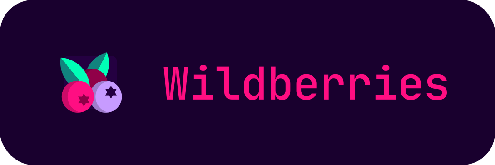
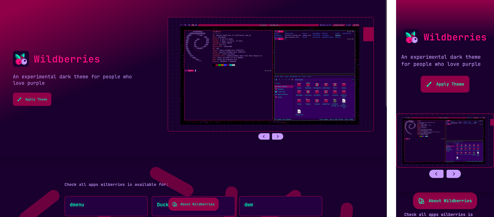

<div align="center">

<h2>An experimental dark theme for people who love purple 🍒</h2>
</div>

<div align="center">

</div>

Wildberries is a purple dark theme, with additional
bright accents, almost in a cyberpunkish way.

Being just a developer and not a graphic designer, I came up with this
color scheme by pure personal taste, however, by time passing and many
applications being customized, I tried to follow some consistencies, and came up with the colors below:

### `Background Colors`

| Palette     | Hex       | RGB         | HSL                 | 🎨                                                                  |
| ----------- | --------- | ----------- | ------------------- | ------------------------------------------------------------------- |
| Black Berry | `#19002E` | `25 00 46`  | `272.6° 100% 9%`    |  |
| Grape       | `#240041` | `36 00 65`  | `273.2° 100% 12.7%` |        |
| Cherry      | `#900048` | `144 00 72` | `330° 100% 28.2%`   |       |

### `Foreground Colors`

| Palette | Hex       | RGB           | HSL                 | 🎨                                                                   |
| ------- | --------- | ------------- | ------------------- | -------------------------------------------------------------------- |
| Pink    | `#ff0e82` | `255 14 130`  | `331.1° 100% 52.7%` |    |
| Green   | `#00ffb7` | `0 255 183`   | `163.1° 100% 50%`   |   |
| Purple  | `#c79bff` | `199 155 255` | `266.4° 100% 80.4%` |  |

### `Auxiliar Colors`

| Palette | Hex       | RGB          | HSL                 | 🎨                                                                   |
| ------- | --------- | ------------ | ------------------- | -------------------------------------------------------------------- |
| Orange  | `#ff4500` | `250 141 62` | `25.2° 94.9% 61.2%` |  |
| Red     | `#d70040` | `215 0 64`   | `342.1° 100% 42.2%` |     |
| Yellow  | `#ffd700` | `255 215 0`  | `50.6° 100% 50%`    |  |
| Blue    | `#399ee6` | `57 158 230` | `205° 77.6% 56.3%`  |    |
| Aqua    | `#00f7e2` | `0 247 226`  | `174.9° 100% 48.43%`  |    |

  <!-- alternative for purple: #a470d8 -->
  <!-- Another interesting purple: #ac4ea4 -->

## ⚙️ Install the theme

All instructions can be found at [wildberries.style](https://wildberries.style/).

## 🗃️ About this repository

This repository is:

- The **Astro project** of the [wildberries.style](https://wildberries.style/) website, with minimum javascript on the client-side;
- The original **ports' source files** and install instructions, on [src/content/ports](https://github.com/gbgabo/wildberries/tree/main/src/content/port);

The generated website offers:

- A **Home** page, indexing all theme ports available to install;
- Dedicated **Instruction** pages for each application port, accessible in `wildberries.style/[port-name]`
- An **About** page, to describe the theme and display colors;
- **Open Graph images** for every page;

### Commands

All commands are run from the root of the project, from a terminal:

| Command             | Action                                             |
| :------------------ | :------------------------------------------------- |
| `npm install`       | Installs dependencies                              |
| `npm run dev`       | Starts local dev server at `localhost:4321`        |
| `npm run check`     | Run astro lint check                               |
| `npm run build`     | Build your production site to `./dist/`            |
| `npm run preview`   | Preview your build locally, before deploying       |
| `npm run astro ...` | Run CLI commands like `astro add`, `astro preview` |


## ➕ Adding a new port

Have you ported **Wildberries** to another application? You can contribute it to this project!

Each port requires:

* An **instruction file** (`.md`)
* At least one **screenshot image**
* Optional **installation assets** (if the port requires additional files)

These files are organized across three directories in the repository.

### Instruction file

Create a markdown file describing how to install and use the port.

**Location:** `src/content/port/<port-name>.md`

This file should contain the installation instructions and the required frontmatter metadata.

#### Metadata reference

| Field          | Description                               |
| -------------- | ----------------------------------------- |
| `title`        | Name of the application the port targets  |
| `platforms`    | Supported operating systems               |
| `contributors` | GitHub usernames or names of contributors |
| `images`       | Screenshot filenames                      |
| `assets`       | Downloadable installation files           |
| `draft`        | If `true`, the port will not be published |

Example:

```md
---
title: Doom Emacs
platforms: ["linux", "windows"]
contributors: ["your-name"]
images: ["/src/assets/images/ports/doom-emacs.png"]
assets: ["wildberries-doom-theme.zip"]
---

1. Download the theme files.
2. Place them in your Doom Emacs config directory.
3. Enable the theme in your configuration.
```

You can include any steps or explanations necessary to guide users through the installation process.

### Screenshots

Screenshots illustrate how the port looks in the target application.

**Location:** `src/assets/images/ports/`

Add the screenshot files there and reference them in the `images` field of the instruction file.

Example:

```
src/assets/images/ports/doom-emacs.png
```

---

### Installation assets (optional)

If the port requires downloadable files (themes, configs, plugins, etc.), place them in: `public/ports/`

Example:

```
public/ports/wildberries-doom-theme.zip
```

Each file listed in the `assets` field will automatically generate a **download button** on the port page.

## 🌟 Credits

- Website inspired by [dracula theme](http://draculatheme.com/) by Zeno Rocha.

## ⚖️ License

[MIT License](./LICENSE) - Wildberries Theme
